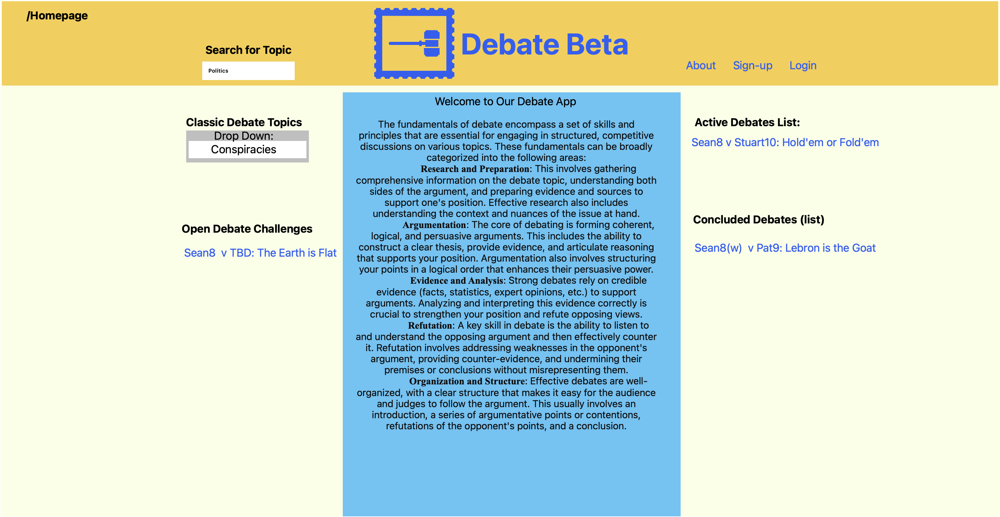
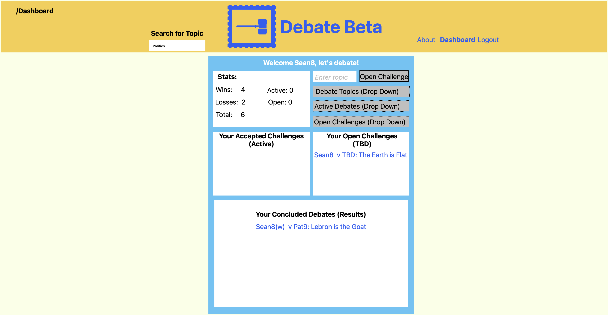
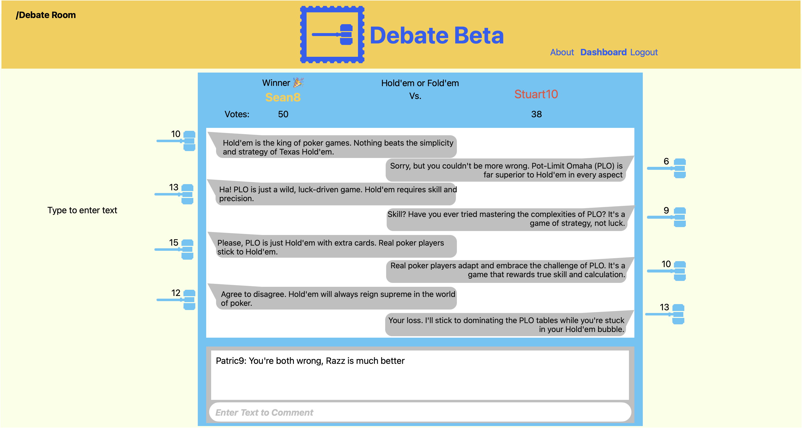
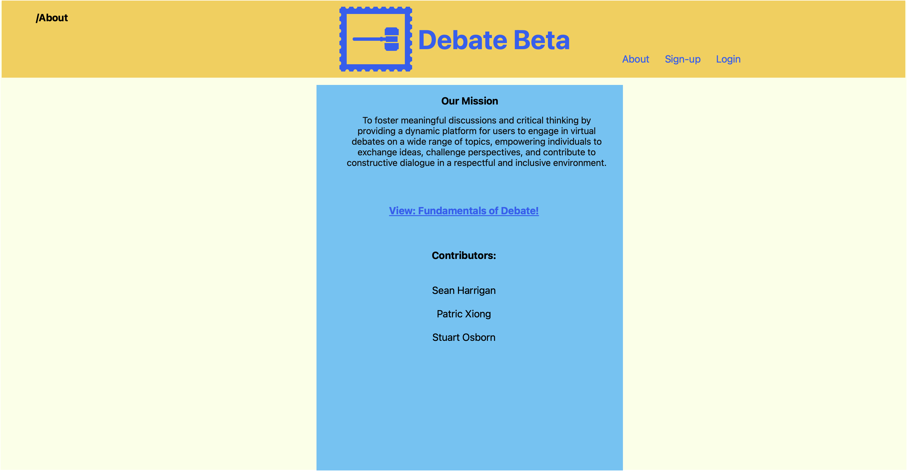

# Debate Beta
A webservice community for debate lovers that allows them to debate as a participant or spectate debates; built with the MERN stack (Mongoose/MongoDB, Express.js, React, and Node.js. 

## Planning Links

- [User Story Board](https://app.cardboardit.com/maps/guests/27da7b0f7a5dca69beb15dba474584eda74515516ca5ca44db7234cba05fc7d4)

- [Debate Beta: Wire Frame](https://www.icloud.com/freeform/0c4kjEBvm82DzXh2cVhdYQH9w#Debate_App_Beta_(Homepage))

## User Story:
```
- As a lover of debate eager for intellectual stimulation and a venue to express my thoughts with eloquent rhetoric
- I WANT to join a community of debate enthusiasts where I can debate
- SO THAT I can learn the fundamentals of debate, build my critical thinking skills, and flex my awesome, but brutal intellect, so I can DESTROY the arguments of others. 
```

## Acceptance Criteria:
```
- WHEN a visitor lands on the Debate Beta web service 
THEN the visitor can see debate fundamentals, search for topics, view predefined topics, signup, login, see a list of active debates, and view about page (view concluded debates). 
- WHEN I am not signed in 
THEN I can only signup, see a list of featured active debates, view the about page, or view a list of concluded debates and see their transcripts and winner. 
- WHEN I click sign up 
THEN I am taken to a form to sign up as a new user.
- WHEN I click login 
THEN I am taken to my user dashboard.
- WHEN I click on an active debate link 
THEN I am prompted to login 
- WHEN I click link to view about page 
THEN I am taken to the about page.
- WHEN I view the Dashboard 
THEN I can see links for accepted debate challenges to join the room as a participant, see links to join active/featured debates as a spectator, choose predefined a topic to open a challenge, propose a topic to open a debate, accept open debate challenges.
- WHEN I click the link for the accepted debate challenges as a participant 
THEN I am taken to the room for the debate challenge. 
- WHEN I am in the debate room as participant 
THEN I am shown whose turn it is, can view prior posted arguments and WHEN it is my turn 
THEN I can enter a character limited argument and 
WHEN submitted 
THEN the argument is shown on the page and the turn toggles to the opponent participant. Additionally, I can comment in the comment section. 
- WHEN the debate concludes after a predetermined number of rounds 
THEN votes are tallied and a winner is announced above the debate arguments in place of the turn element (EVP. and the debate form/transcript is added as a readonly object to the list of concluded debates). 
- WHEN I click the field to to join as a spectator 
THEN I am presented with a list of active debates with the participant user names and debate topic that I can spectate and WHEN I choose a debate 
THEN I am taken to the debate room as a spectator. 
- WHEN I join the room as a spectator 
THEN I am presented with the same room as above, but I can only vote on the winner of each argument/rebuttal pair or make a comment in the comment section. 
- WHEN I click the field to choose a predefined topic to debate 
THEN I am presented with a drop down list of options to debate.
- WHEN I click on a predefined debate topic 
THEN a link is generated for that debate topic and it is added to my open active debate challenges until 
WHEN someone accepts the challenge and 
THEN it is added to my accepted active debate challenges. 
- WHEN I enter a debate topic in the input field and submit 
THEN a link is generated for that debate topic and it is added to my open active debate challenges until someone accepts the challenge and THEN it is added to my accepted active debate challenges.
- WHEN I click the field to see open debate challenges of other users
THEN I am presented with a list of usernames and topics of debate challenges that I can accept and 
WHEN I accept an open debate challenge 
THEN a link is generated and added to my accepted active debate challenges. 
- WHEN I view the about page 
THEN I am presented with a mission statement for the app, a list of contributors, and a link for debate fundamentals that returns you to the home page (EVP: contact/feedback form, FAQ section). 
- WHEN I click the logout button 
THEN I am logged out of the app.
```  

## Wire Frame Mock Up





## Component Structure (best viewed in raw markdown)

App  
├── Header  
│   ├── Navigation  
│   └── UserMenu  
├── Routes  
│   ├── HomePage  
│   │   ├── DebateFundamentals  
│   │   ├── SearchTopics  
│   │   ├── PredefinedTopics  
│   │   └── FeaturedDebates  
│   ├── AboutPage  
│   │   ├── MissionStatement  
│   │   ├── Contributors  
│   │   └── DebateFundamentalsLink  
│   ├── SignUpPage  
│   │   └── SignUpForm  
│   ├── LoginPage   
│   │   └── LoginForm  
│   ├── DashboardPage  
│   │   ├── ChallengeLinks  
│   │   ├── SpectateDebatesLinks  
│   │   ├── OpenDebateChallenges  
│   │   ├── ProposeTopicForm  
│   │   └── AcceptDebateChallenges  
│   └── DebatePage  
│       ├── DebateRoom  
│       │   ├── TurnIndicator  
│       │   ├── ArgumentList  
│       │   │   └── ArgumentItem  
│       │   └── CommentSection  
│       │       └── CommentItem  
│       └── SpectatorView  
│           ├── SpectatorRoom  
│           │   └── VoteAndComment  
│           └── SpectateDebateList  
└── Footer

## Contributors 

- Sean Harrigan
    - [](https://github.com/seanharrigan8)
    [](https://www.linkedin.com/in/sean-harrigan8/)

- Patric Xiong 
    - [](https://github.com/PatricXiong)

- Stuart Osborn
    - [](https://github.com/stuartgosborn)
    [](https://www.linkedin.com/in/stuartgosborn?trk=profile-badge)